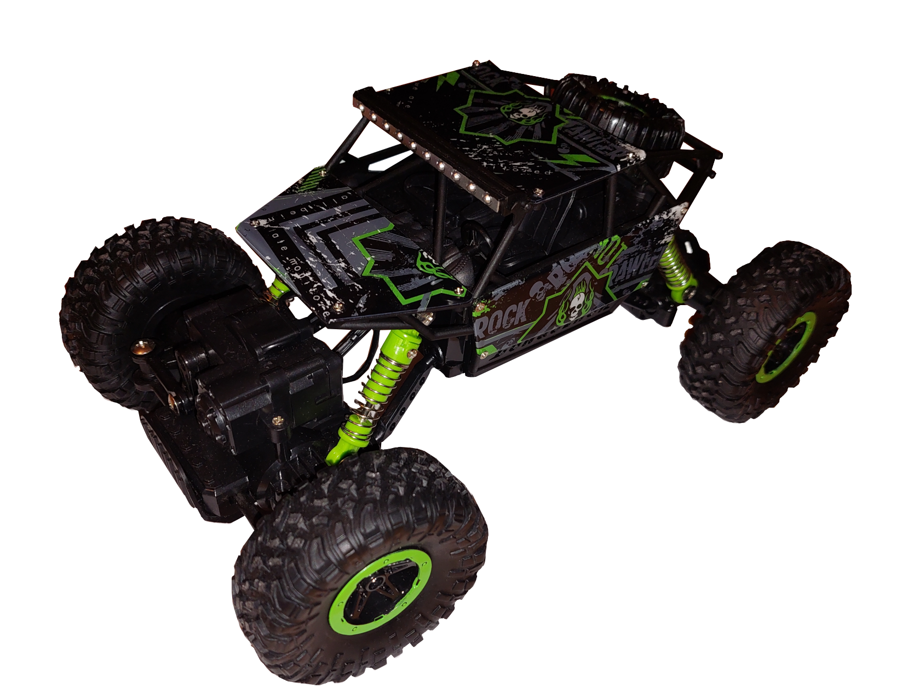
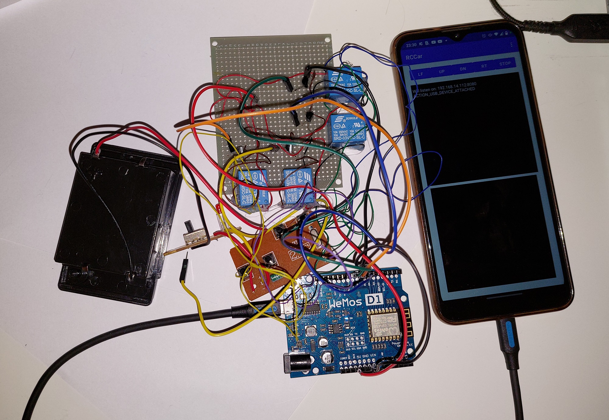
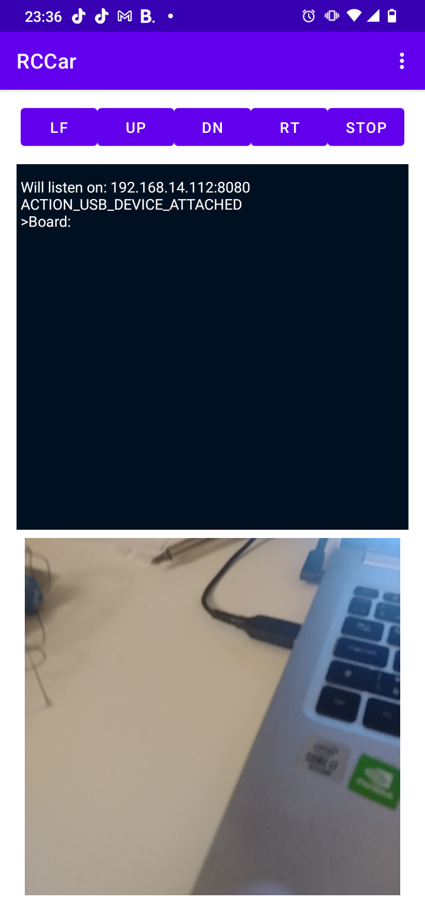

# RC Car

## Overview
 - Hardware
   - Car
   - Phone 
   - Esp8266 
 - Software
   - Computer Program to control
   - Android app
   - Board program
    
## Hardware

## Computer program

 - Shall be able to connect to phone (ip address, port) in local network
 - Shall be able to control car movement (forward / backward [-1.0, 1.0], steering [-1.0, 1.0])
 - Shall be able to receive images from camera
 - Shall be able to record it camera image
 - Shall be able to receive GPS info, accelerometer value (?)
 - Shall be able to receive phone info - battery percent
 - Control usingKeyboard / Gamepad / Wheel ?

## Android App
 - Shall be able to run http server
 - Shall be able to receive command for car movement
 - Shall be able to stream camera to computer program in real time 
 - Shall be able to send GPS and other phone info
 - Shall be able to connect the board and send command (speed, steering)

### API
 - `GET /camera` - return image 
 - `GET /info` - return phone info 
 - `GET /camerapREVIEW` - return a small image 
 - `GET /position?timeout=` - return GPS position
 - `GET /drive?motor=[speed]&steering[angle]` -  control car
 - `POST /setStream?ipAddress=[ipAddress]&port[port]` -  set the stream receiver
 - `POST /startStream` -  start stream to the set receiver
 - `POST /stopStream` -  stop stream

## Board program
 - Shall receive info from phone and set motors and steering according it.
 - Communication using Wifi (hotspot) or serial port
 - WIFI:
      - In board program `USE_WIFI true`
      - Run on port `5101`
      - UDP Packet structure (3 bytes) - `[1, STEERING, MOTOR]`
         - `STEERING` - `1` - LEFT, `2` - RIGHT, `3` - STRAIGHT, other values does not change current status
         - `MOTOR` - `1` - FORWARD, `2` - BACKWARD, `3` - STOP, other values does not change current status
 - Serial Port
      - In board program `USE_WIFI false`
      - Communication via USB Serial.
      - Packet structure (3 bytes) - `[1, STEERING, MOTOR]`
         - `STEERING` - `1` - LEFT, `2` - RIGHT, `3` - STRAIGHT, other values does not change current status
         - `MOTOR` - `1` - FORWARD, `2` - BACKWARD, `3` - STOP, other values does not change current status