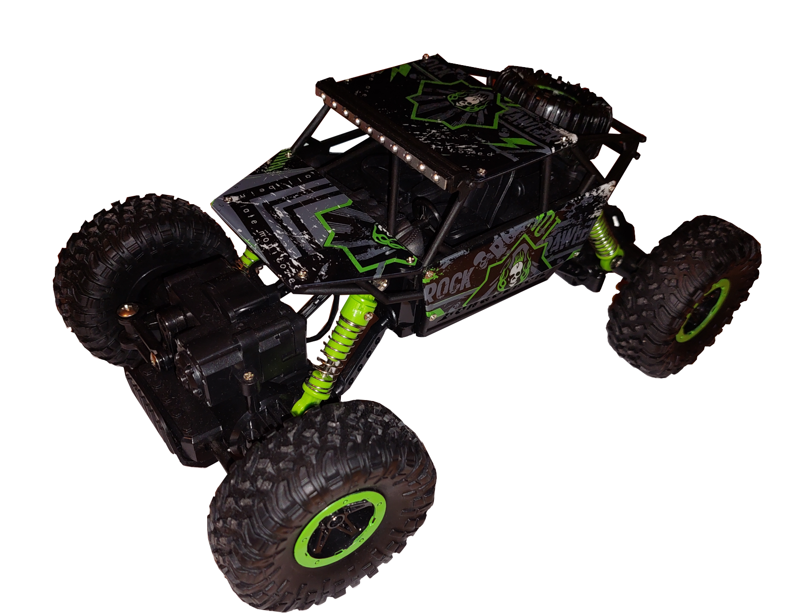

# Hardware

- RC Car (Rock Crawler Reely 1:18)
  - 
- ESP8266 (WEMOS D1 R2 WiFi)
- 4x Relay 3.3V
- 4x NPN Transistors

## Instructions
1. Extract battery and board from RC Controller
    -  
    
2. Locate buttons on board from RC Controller. There are buttons for each movement: left/right, forward / backward.
    - 
3. Create circuits with relays and transistors in order to simulate clicking on controller buttons.
    - 
4. Connect wires to Wemos as described in picture above

## Car modifications